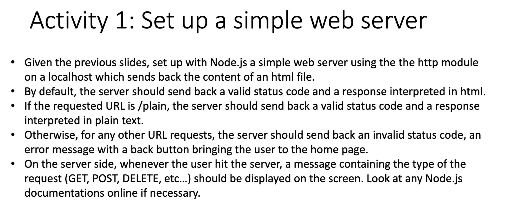
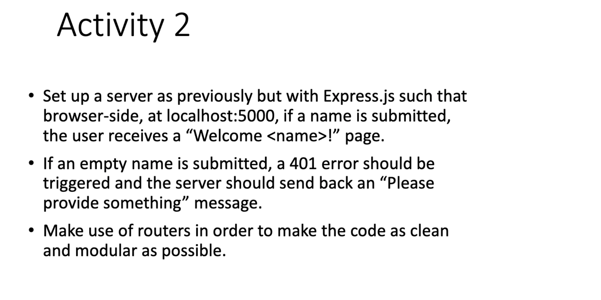

# Homeworks for Submission [2021-08-03]

## 1. Activity 1

```js
const http = require('http');
const {readFileSync} = require('fs');

const homepage = readFileSync('./index.html')

const server = http.createServer((req,res) => {
    console.log(req.url);
    console.log(req.method);
    if (req.url === '/') {
        res.writeHead(200, {'Content-Type': "text/html"})
        res.write(homepage)
        res.end();
    } else if (req.url === '/plain') {
        res.writeHead(200, {'Content-Type': "text/plain"})
        res.end('This webpage is my plain text blog.');
    } else {
        res.writeHead(404, {'Content-Type': "text/html"})
        res.end(`
            <h1>Sorry</h1>
            <p>This page does not exist yet.</p>
            <a href="/" >Back Home</a>
        `)
    }

});

const port = server.listen(5000);
```
## 2. Activity 2


```js
// activity2.js
const express = require('express');
const app = express();

const auth = require('./routes/auth')

//utilising the method-public form
app.use(express.static('./method-public'));

app.use(express.urlencoded({ extended: false}));

app.use('/', auth);

const PORT = 5000;
app.listen(PORT, ()=>{
    console.log(`Server is listening at port ${PORT} ...`);
});

// routes/auth.js
const express = require('express');
const router = express.Router();

router.post('/login', (req, res)=>{
    const { name } = req.body;
    if (name) {
        return  res
                .set({"Content-Type": "text/html"})
                .status(200)
                .send(`
                <h1>Welcome ${name} !</h1>
                <a href="/">Back Home</a>
                `)
                .end();

    } else {
        return  res
                .set({"Content-Type": "text/html"})
                .status(401)
                .send(`
                <h1>Please provide something</h1>
                <a href="/">Back Home</a>
                `)
                .end();
    }
})

module.exports = router;


//method-public/

```